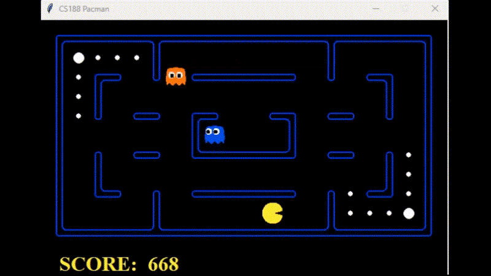

# Pacman AI: Alpha-Beta Search and Reinforcement Learning

School project at **HE2B – ESI** (Brussels). I built two Pacman agents in Python:

- **AlphaBetaAgent**: minimax search with alpha-beta pruning and a hand-made evaluation function. **Finished.**
- **RLMinimaxAgent**: the same search, but it *learns* its evaluation function with reinforcement learning (TD(0) with linear features). **Paused (training not finished).**



The game engine (maze, ghosts, graphics) is the [UC Berkeley Pacman AI framework](http://ai.berkeley.edu), which my teachers gave us.
**My code** is `multiAgents.py` and the `multiAgentsUtils/` folder.

---

## About the source code

The Berkeley framework asks students **not to publish solutions**, because the project is still used in courses. I respect this rule, so this README explains my work in **pseudo-code** instead of showing the real code.

**The full source code is available on request.** Contact me and I will give you access.

---

## Results

AlphaBetaAgent, 100 games per line, default ghosts (random moves).
The `-f` option fixes the random seed, so you get the same numbers if you run the same command.

| Layout | Depth | Win rate | Average score | Time (100 games) |
|---|---|---|---|---|
| smallClassic  | 2 | 62 % | 905  | ~16 s |
| smallClassic  | 3 | 74 % | 1147 | ~20 s |
| mediumClassic | 2 | 74 % | 1411 | ~39 s |
| mediumClassic | 3 | **89 %** | **1783** | ~46 s |

```bash
python pacman.py -p AlphaBetaAgent -l mediumClassic -n 100 -q -f -a depth=3
```

---

## How to run

> These commands need the source code, which is available on request (see "About the source code").

The framework imports its files as the package `pacman_multiagent`.
Python 3, no external library (the graphics use Tkinter, which comes with Python).

```bash
cd pacman_multiagent

python pacman.py -p AlphaBetaAgent -l mediumClassic
```

| Option | Meaning |
|---|---|
| `-l mediumClassic` | layout (`smallClassic`, `mediumClassic`, `originalClassic`, ...) |
| `-a depth=3` | search depth (default: 2) |
| `-n 100 -q` | play 100 games without graphics, show only the results |
| `-f` | fixed random seed (same results every time) |

---

## 1. AlphaBetaAgent

### Alpha-beta search

Pacman wants the **highest** value, the ghosts want the **lowest** value. The search looks at the possible moves a few steps ahead, and it stops exploring a branch as soon as this branch cannot change the final choice (pruning).

```text
function ALPHA_BETA(state, agent, depth, alpha, beta):
    if state is a win or a loss:
        return (score of the game, no action)
    if depth == MAX_DEPTH or time is over:
        return (EVALUATE(state), no action)

    if agent is Pacman: best = -infinity      # maximizer
    else:               best = +infinity      # minimizer (ghost)

    for each legal action of agent:
        value = ALPHA_BETA(next state, next agent, depth + 1, alpha, beta)

        if agent is Pacman and value > best:
            best, bestAction = value, action
            alpha = max(alpha, best)
        if agent is a ghost and value < best:
            best, bestAction = value, action
            beta = min(beta, best)

        if beta <= alpha:
            stop the loop                     # pruning

    return (best, bestAction)
```

**Design choices**

- **One search class, two agents.** The search is in one class (`AlphaBetaSearch`), used by both agents. Only the evaluation function changes: hand-made for AlphaBetaAgent, learned for RLMinimaxAgent.
- **Depth = one move of one agent.** With 2 ghosts, `depth=3` means Pacman, ghost 1, ghost 2 (one full turn). It is simple to follow, and it makes the cost of each level clear. The Berkeley convention counts full turns instead.
- **Terminal states use the real score.** When the game is won or lost, the exact result is better than an estimate.

### Evaluation function

When the search stops, it must give a value to a state it did not finish exploring.

```text
function EVALUATE(state):
    distances = BFS from Pacman to every cell of the maze     # done only once

    value = game score
    value -= number of food dots left

    if a food dot exists:
        value += FOOD_BONUS / (distance to nearest food + 1)

    if an active ghost exists:
        value -= GHOST_PENALTY / (distance to nearest active ghost + 1)

        if a capsule exists and Pacman can reach it before the ghost:
            value += CAPSULE_BONUS / (distance gap + 1)

    if a scared ghost exists:
        value += SCARED_GHOST_BONUS / (distance to nearest scared ghost + 1)

    return value
```

**Design choices**

- **Real maze distances with one BFS.** The Manhattan distance ignores walls: a ghost can look near but be far away behind a wall. I run **one** breadth-first search from Pacman, and then I read the distance to every food dot, capsule and ghost in O(1). It is more precise than Manhattan, and much cheaper than one search per target.
- **`1 / (distance + 1)`.** The value is between 0 and 1, big when the target is near, and it never divides by zero. Being 1 cell closer matters a lot when the target is near, and almost nothing when it is far.
- **Weights with a clear order.** Scared ghost (200) > capsule (50) > food (10) = ghost danger (10). Eating a scared ghost gives many points, and the capsule is the way to make ghosts scared. The values are named constants, so they are easy to tune.
- **Food count penalty.** When Pacman eats a food dot, the nearest food is now farther away, so the "nearest food" bonus goes **down**. The penalty for each food dot left makes sure that eating is always better than waiting next to the food.

---

## 2. RLMinimaxAgent (paused)

The idea: keep the alpha-beta search, but **learn** the evaluation function instead of writing it by hand.

### Features and value

A state is described by 7 numbers (features), all between 0 and 1:

| Feature | Meaning |
|---|---|
| `nearestFoodDistance` | nearest food, `1/(d+1)` |
| `foodCount` | food left, `1/(n+1)` |
| `nearestActiveGhostDistance` | active ghost, only when closer than 4 cells |
| `nearestCapsuleDistance` | nearest capsule, when an active ghost exists |
| `betweenActiveGhostAndCapsule` | the capsule is closer than the ghost: go now |
| `nearestScaredGhostDistance` | nearest ghost that Pacman can eat |
| `bias` | always 1 (base value of every state) |

```text
V(state) = sum of  weight[i] * feature[i](state)
```

### Learning (TD(0))

After each move, the agent compares what it expected with what really happened, and it corrects the weights.

```text
at the start:
    load the saved weights
    (if there is no file: each weight = 1 / number of features)

for each move (state -> nextState, reward):
    reward = clip(reward, -100, +500)

    if nextState is the end of the game: V(nextState) = 0

    error = reward + gamma * V(nextState) - V(state)       # TD error

    for each feature i:
        weight[i] = weight[i] + alpha * error * feature[i](state)

choose a move (epsilon-greedy):
    with probability epsilon:      random move            # explore
    else:                          ALPHA_BETA(state)      # use what we learned

after each game:
    epsilon goes down in a straight line    (explore less and less)
    alpha goes down slowly, then faster     (learn more gently at the end)
    every 100 games: save the weights and the progress (JSON)
```

**Design choices**

- **Linear features instead of a Q-table.** Pacman has too many states to store them one by one. With 7 features, the agent can generalize: what it learns in one part of the maze also works in another part.
- **Non-zero start weights (`1/n`).** With all weights at 0, every state has the value 0, so the search cannot choose between actions at the start of training.
- **Reward clipping.** Winning, losing or eating a ghost gives very big rewards. Without a limit, one big reward can make the weights explode.
- **Decay of alpha and epsilon.** At the start, the agent must explore and learn fast. At the end, it must use what it learned and stay stable.
- **Save and resume.** Training takes a long time. The weights and the progress are saved every 100 games, so I can stop and continue later.
- **The feature `betweenActiveGhostAndCapsule` is an estimate.** It compares the distance Pacman→ghost with the distance Pacman→capsule. It does not compute the real ghost→capsule distance, because that would need one BFS per ghost.

### Trade-off: time limit per decision

Every leaf of the search runs a BFS, and training needs hundreds of thousands of games. On my laptop, this cost grew too fast. So **RLMinimaxAgent has a time limit of 0.1 s per decision**. When the time is over, the remaining nodes are evaluated directly instead of being searched deeper.

- **Advantage:** the agent always answers fast, and training is possible on normal hardware.
- **Cost:** the results depend on the speed of the machine, so they are not fully reproducible, and the search can evaluate nodes at different depths.
- **Options:** change it with `-a timeLimit=0.5`, or turn it off with `timeLimit=0`.
- **AlphaBetaAgent has no time limit** (pure alpha-beta search).

A better solution would be **iterative deepening**: search at depth 1, then 2, then 3..., and keep the result of the last complete depth. It respects the time limit without mixing depths.

### Current status: paused

This agent is not finished, and I have paused its training.

- About 277,000 training games are done, but the results are not stable yet,
  so I do not publish numbers for this agent.
- The main limit is compute: every move runs an alpha-beta search, and every
  leaf of the search runs a BFS. On my laptop, training at depth 3 takes days
  and slows down the whole machine.
- The code for learning, saving and resuming works: the pseudo-code above shows
  the full design and the reasons for each choice.

What I would do to finish it:

- Make each move cheaper: cache the BFS results, or train with a smaller depth.
- Use iterative deepening instead of the fixed time limit.
- Put the terminal score and the learned value V(s) on the same scale.
- Compare the learned agent with AlphaBetaAgent on the same layouts and seeds.

```bash
# Train (numTraining = total number of games, old games included)
python pacman.py -p RLMinimaxAgent -l smallClassic -x 300000 -n 300000 -q -a depth=3

# Play with the learned weights (no training)
python pacman.py -p RLMinimaxAgent -l smallClassic -n 10 -a depth=3
```

---

## Project structure

```text
pacman_multiagent/
├── multiAgents.py            # MY CODE: AlphaBetaSearch, AlphaBetaAgent, RLMinimaxAgent, evaluation function
├── multiAgentsUtils/         # MY CODE
│   ├── constants.py          #   named constants (bonuses, limits, file paths)
│   ├── pacmanHelpers.py      #   BFS, features, weights, save/load
│   └── data/                 #   learned weights + training progress (JSON)
├── pacman.py, game.py, ...   # Berkeley framework (not my code)
└── layouts/                  # mazes
```

## What I learned

- Adversarial search: minimax, alpha-beta pruning, and the cost of each extra level of depth.
- How much a good evaluation function matters: with the same search, it changes everything.
- Reinforcement learning with function approximation: features, TD error, learning rate, exploration.
- Real limits: training time, hardware, and the trade-off between speed and precision.

## Possible improvements

- Finish the training of RLMinimaxAgent (see its status above).
- Move ordering (try the best moves first) to prune more branches.
- Unit tests for the helpers (BFS, features).

## Credits

- Game engine: [UC Berkeley CS188 Pacman AI projects](http://ai.berkeley.edu) (John DeNero, Dan Klein and others).
- Project given by my teachers at HE2B – ESI.

## Author

**Ian** - Student in Application Development at HE2B-ESI, Brussels

[LinkedIn](https://www.linkedin.com/in/ian-grande/) · [GitHub](https://github.com/ian-grande-dev) · [Email](mailto:ian.grande.pro@gmail.com)
